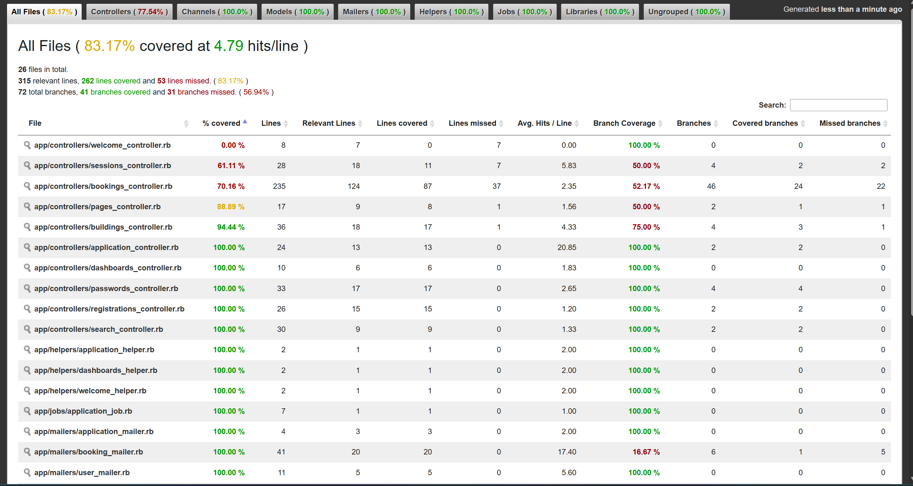
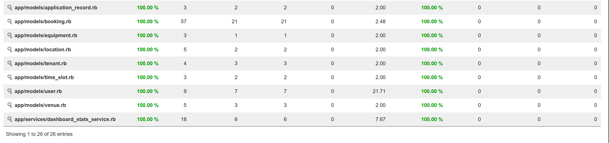

# csci3100_project_group6
## Set up Guide

Install gems and set up the database:

```sh
bundle install
bin/rails db:create db:migrate db:seed
```

Run the app:

```sh
bin/rails server
```


## Ownership of each implemented feature
| Feature Name | Primary Developer (Name) | Secondary Developer | Notes |
| -------- | -------- | -------- | -------- |
| Backend: Database & Booking System | Lam Tsz Yi | Ho Chi Tung | Schema design, CRUD, Seed Data, Conflict Detection, Status Management |
| External API: SendGrid | Ho Chi Tung |  | Integrated external API SendGrid to send the emails |
| External API: Google Map | Huang Chun Kin | Chee Chun Lok Wong Hoi Hei | Integrated external API of Google Map |
| Interactive Dashboard | Chee Chun Lok | Wong Hoi Hei Huang Chun Kin | interactive dashboard for reviewing the usage of facilities |
| Searching Engine | Wong Hoi Hei | Chee Chun Lok Huang Chun Kin | performed with Autocomplete |
| UI design and routing | Wong Hoi Hei | Chee Chun Lok Huang Chun Kin  | Basic operation |
|Testing (RSpec & Cucumber)| All members|  | Model, Controller, Feature tests |


## Screenshot of the SimpleCov report:


